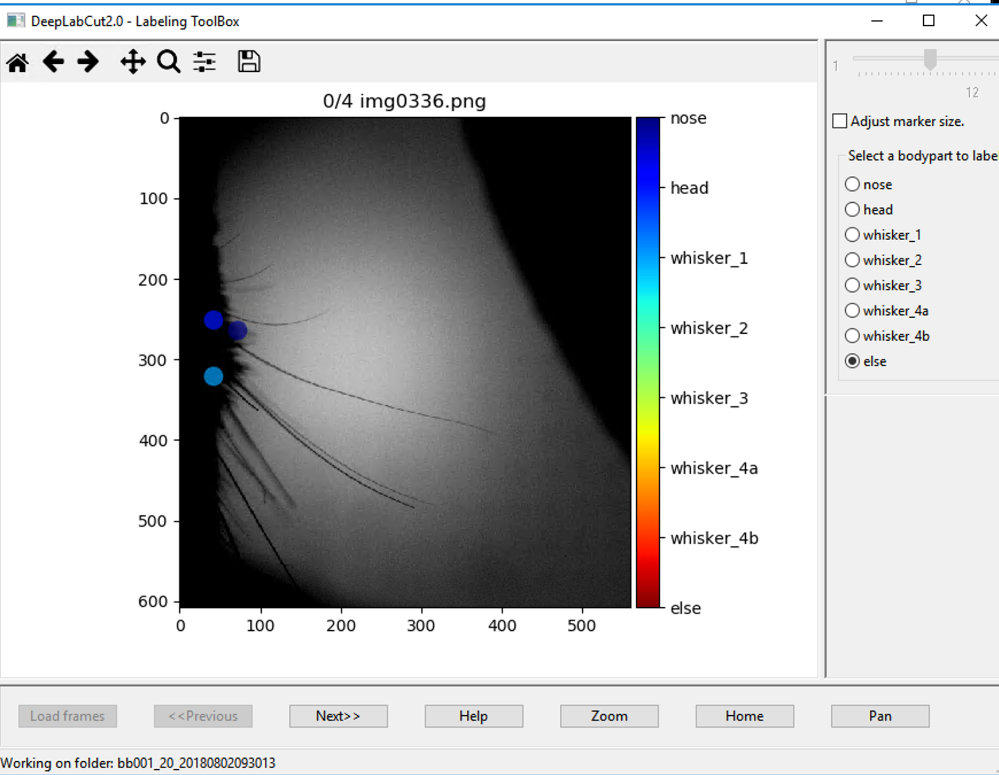

# Setting up DeepLabCut for labelling videos

### Necessary-Prior-Knowledge

1. It is highly recommended for you to read the [user guide](<https://alexemg.github.io/DeepLabCut/docs/UseOverviewGuide.html>)
2. A basic understanding of YAML files is helpful ([this is more than enough](<https://rollout.io/blog/yaml-tutorial-everything-you-need-get-started/>))
3. You should know how to run a single shell script on your environment. This is covered in the section below.

## Workflow Setup

### A. Pre-Installation

   - Bash - If using Windows, make sure to have *Git Bash*. You can install it [here](https://gitforwindows.org/). MAC systems should already have a terminal by default.
   - Conda - You can install it [here](<https://docs.conda.io/projects/conda/en/latest/user-guide/install/index.html>)

     ### How to run a single script Using Bash (Will come into use later)
     

   - Launch Git Bash [as admin](https://www.groovypost.com/howto/make-windows-10-apps-always-run-with-administrator-privileges/) on Windows, or Terminal on MAC([Hints here](https://macpaw.com/how-to/use-terminal-on-mac))

   - Enter "cd <path>" where <path> is your system path to the shell script

     Example: if I have a script in the folder bash_scripts, we can execute:

        > cd C:\Users\Zack\Documents\GitHub\neuro-circuit\DeepLabCut\bash_scripts" 
    
   - Run the script

     - **Windows**:  In command prompt, enter "<name_of_script>" and press enter
        > "script.sh"

     - **Mac**: In terminal, enter "sh <name_of_script>" and press enter

       > "sh script.sh"

### B. Environment & Project Creation

1. **Custom Configuration** 

    The project allows you to set some parameters such as the specifying directory containing the raw videos, algorithm for frame extraction, number of frames per video, etc. To edit the defaults, open the **pre_config.yaml** file with a text editor, and change the parameters to suit your project (see explanations of most of the parameters in the guide mentioned in "necessary-prior-knowledge")

2. **Initial Setup** 

    Using your specified terminal, run **initial_setup.sh** in the folder **bash_script** (instructions below). It typically takes 10-15 minutes the first time. **Do not exit even if the terminal shows "Done" as there are more steps.** 

    When the script is finished, it generally should output "all set: press enter to continue."

3. **Frame Extraction** 

   If you have selected manual frame-extraction, the extracting GUI would launch. If not, DLC will automatically do this for you.
    Note you may get an error by selecting Load Videos but closing the file explorer without choosing anything

4. **Labelling**  The labeling GUI would launch

   * The labels on the side are the ones specified in the config file.
   * To capture whiskers in detail, you can have multiple labels on one whisker as well.
   * Click "Load frames"
   * Each video would have its own folder (named same as the video) in ".../<working_directory> aka the project folder\labeled-data\" (which needs to be a full path)
   
   * Select the folder for the video you want to label

     *Note the folder name is misleading since it contains both labeled and unlabeled images*

  

   Feel free to quit if you decide to take a break. Continue labeling by the step below: "Continue to Label"

### C. Continue to Label after exiting

Run the standalone script "label_frames.sh" in the folder "bash_scripts".

### Other Useful Tips

  * OPTIONAL if training on your local system:have an NVIDIA driver installed, and CUDA (currently, TensorFlow 1.13 is installed inside the env, so you can install CUDA 10 and an appropriate driver)

     DRIVERS: https://www.nvidia.com/Download/index.aspx

     CUDA: https://docs.nvidia.com/cuda/cuda-installation-guide-microsoft-windows/index.html#verify-you-have-cuda-enabled-system
     
* When you have accidentally made a mistake, if you have not put too much work in, it is often best to 
  
  * delete the project folder 

  * or even the conda environment (as well as the environment folder usually located at C:\Users\<Username>\\.conda\envs) 

  and start the script over

* If something goes wrong with the software, feel free to check the errors displayed in that window

* If there is no error among the previous output, just press any key in its window to exit the script. Otherwise, feel free to consult [the original repository's troubleshooting tips](<https://github.com/AlexEMG/DeepLabCut/wiki/Troubleshooting-Tips>) or contact us (see button).

     [Versions to Use/Troubleshooting](https://github.com/AlexEMG/DeepLabCut/blob/master/docs/installation.md#troubleshooting)

### I have labelled my data. What next?

You can now custom train DeepLabCut! Please follow their train/test tutorial that uses the frames you annotated. One such example is their Mouse Reaching demo:

https://github.com/AlexEMG/DeepLabCut/blob/master/examples/Demo_labeledexample_MouseReaching.ipynb

## Questions?
Contact BU SAIL : shreyap@bu.edu, zackL@bu.edu
