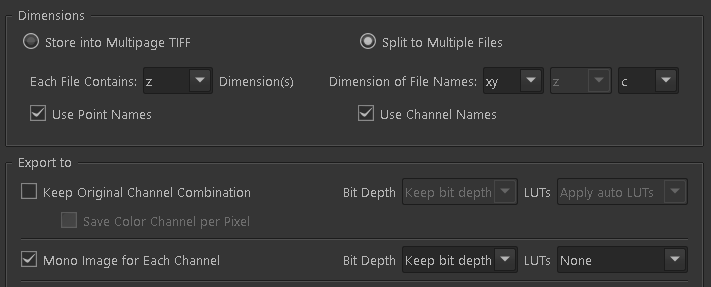
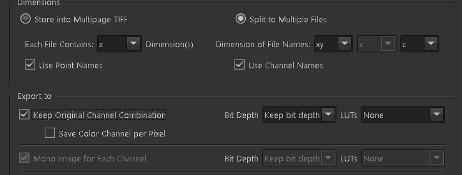

## Image Processing Instructions
Output of the microscope is a single ND2. This document outlines protocols and scripts involved to stitch and segment images for the Starfish pipeline. Alignment and registration will be done in Neurotator and is not discussed here.

### Folder structure
See `X:\ARG_Analysis` for example
* Round
  * Sample
    * Channel  
    

### Tools
* NIS Element
* [TeraStitcher](https://github.com/abria/TeraStitcher)
* [Baxter Algorithm](https://github.com/klasma/BaxterAlgorithms)

### Steps
#### 1) Convert ND2 file to 9 (3x3) TIFF tiles (NIS Element)
* Open ND2 file
* Save/export to TIFF
* Double check parameters
   * Multi-channel    


   * Single-channel - check "Keep Original Channel Combination"


* Export to `01_Tiles` folder for each channel

#### 2) Stitch TIFF tiles

The `stitch_tiles.py` script in this directory will create the expected file hierarchy for TeraStitcher and then stitch the tiles while removing the overlap (we assume 5%).  This must be done in a separate command prompt for *every* channel.

**Tile coordinates in the file names must be A1-3, B1-3, C1-3**

```
python stitch_tiles.py --input_file="" --input_dir=""
```
Replace tile coordinate in the file name (e.g. A1) with ##

Example:
```
python stitch_tiles.py --input_file="ND Acquisition_##v2_488.tif" --input_dir="X:\ARG_Analysis\Round05\Sample2\488\01_Tiles"
```
Script will take approximately ~15min to run, depending on the size of the images. Double check with ImageJ when the script is finished to make sure that the stitched image looks reasonable.

#### 3b) Downsample
Channel 561 images need to be downscaled for Baxter (16x) and for Neurotator (4x)

Place all the stacks to be downsampled into the script to be done in parallel

```
python Z:\Personnel\Abed\GitHub\tiff_resize\tif_rescale.py --file=<> --scale=4
```

Save to -> `\Stiched\4xDS\`


#### 4) Cell segmentation (Baxter Algorithm)
This step is only done on the 561 channel.
`Z:\Dropbox\Dropbox\Chen Lab Team Folder\Projects\Starotator\MINS alternatives\BaxterAlgorithms-master`


* Type `BaxterAlgorithms` in the Matlab console
* Open Experiment -> 02_Stitched folder -> Make sure it loads the 16x image
* Settings -> Settings
   * Change numZ to the number of Z slices specific to your image
   * Set zStacked to 1
   * Set bits to 12
* Save
* Settings-> Set segmentation parameters
* Start with the parameters shown below, adjust if necessary    

